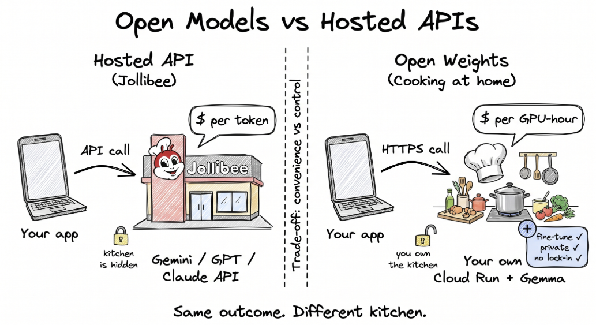

# Deploying Gemma 4 on Cloud Run with vLLM



A hands-on workshop for **GDG Cloud Manila**.

You'll deploy a Gemma 4 instruction-tuned model behind a standard
`/v1/chat/completions` HTTP API on **Cloud Run GPUs**, served by **vLLM**, with
the model weights cached in
**Google Cloud Storage** and streamed at cold-start over **Direct VPC Egress**.

By the end you'll have a **private** HTTPS endpoint you can `curl` (authenticated
with your `gcloud` identity token) for chat completions — streaming and
non-streaming, in English and Tagalog. Making it **public** is an optional,
clearly-warned opt-in.

> 📖 **Browsing on GitHub?** Every file here is Markdown. Open them in order and
> use the copy button on each code block to paste straight into Cloud Shell —
> the `#` comments inside the blocks are valid bash, so they paste harmlessly.

> ### Why Gemma 4 12B for the L4 track?
> Gemma 4 12B was released by Google on **June 2, 2026**. It's a 12-billion-parameter
> dense model that fits perfectly on the L4's 24GB VRAM — better utilization than
> E4B (which was designed for phones), and meaningfully more capable on reasoning
> and coding tasks. **Same cost, better model.** We keep an E4B track too, as the
> lightest-weight starting point.

---

## Two setup options — pick one before Step 1

How you get the model weights into place decides whether you run a few extra steps:

- **Option A — Use the speaker's shared bucket** *(recommended for the workshop — saves ~15–20 min)*
  The weights are already cached. You **skip Steps 4, 5, and 7** and point your
  service straight at the shared bucket. Set this in `step_01_env_vars.md`:
  ```bash
  # Use the path for YOUR track's model — your step_01_env_vars.md already has the
  # exact value:
  #   L4 · E4B  -> .../model-cache/google/gemma-4-E4B-it
  #   L4 · 12B  -> .../model-cache/google/gemma-4-12B-it
  #   RTX · 31B -> .../model-cache/google/gemma-4-31B-it
  export GCS_MODEL_LOCATION="gs://<PROJECT_ID>-asia-southeast1-hf-model-cache/model-cache/google/gemma-4-<E4B|12B|31B>-it"
  ```
  > ⚠️ **The shared bucket is only available during the workshop event and will be
  > revoked afterward.** It's also region-locked to `asia-southeast1`. Full details
  > and all three model paths: [`SHARED_BUCKET.md`](./SHARED_BUCKET.md).

- **Option B — Cache your own model** *(full control — adds ~15–25 min)*
  You run Steps 4, 5, and 7 to download the weights into your own bucket. This is
  what you want for anything you keep past the workshop.

**Time per option:** Option A ≈ 15 min (L4) / 30 min (RTX) · Option B ≈ 30 min (L4) / 45 min (RTX).

---

## The three-track structure

Everyone builds the **exact same architecture** with the **exact same
commands**. The only thing that changes between tracks is a handful of tuning
flags (GPU type, CPU/memory, batching). That's the whole point: the recipe
scales from a tiny model to a high-end one by changing *values*, not *steps*.

| | **L4 · E4B** (starter) | **L4 · 12B** (recommended) | **RTX · 31B** (speaker) |
|---|---|---|---|
| Model | `google/gemma-4-E4B-it` | `google/gemma-4-12B-it` | `google/gemma-4-31B-it` |
| GPU | NVIDIA L4 | NVIDIA L4 | NVIDIA RTX PRO 6000 |
| Model size on disk | ~16 GB (BF16) | ~28 GB (BF16) | ~62 GB (BF16) |
| End-to-end time | ~15 min shared / ~30 min own | ~15 min shared / ~30 min own | ~30 min shared / ~45 min own |
| All-in cost while running | ~$1.42/hr | ~$1.42/hr | ~$3.19/hr |
| Expected workshop cost | ~$1–3 | ~$1–3 | ~$5–10 |
| Directory | [`L4_gemma_e4b/`](./L4_gemma_e4b) | [`L4_gemma_12b/`](./L4_gemma_12b) | [`RTX_gemma_31b/`](./RTX_gemma_31b) |

Both L4 tracks cost the same per hour — 12B just uses the L4's memory far better
than E4B (which was built for phones). Because the step files are **structurally
identical**, when Joshua says "run step 9," you open `step_09_deploy.md` in your
own folder and follow along. His values are bigger; the shape is the same.

---

## Before you start

Read these two files **first**, in this order. Almost every "it didn't work"
issue traces back to a missed prerequisite.

1. **[`00_prerequisites.md`](./00_prerequisites.md)** — GCP project + billing,
   HuggingFace token, and (critically) **accepting the Gemma 4 license terms**
   on the model page. The deploy *will* fail later if you skip the terms.
2. **[`00_cloud_shell_guide.md`](./00_cloud_shell_guide.md)** — how to open and
   use Cloud Shell, where we run every command. No local install needed.

All three tracks share these files; they live at the top level — not duplicated
inside the track folders.

---

## Which directory do I use?

- **Attendees (recommended):** use **[`L4_gemma_12b/`](./L4_gemma_12b)** — Google's
  newest mid-size model, perfectly sized for the L4, same hourly cost as E4B.
- **Attendees (lightest):** use **[`L4_gemma_e4b/`](./L4_gemma_e4b)** if you want
  the smallest, fastest-to-load starting point.
- **Speaker (Joshua):** use **[`RTX_gemma_31b/`](./RTX_gemma_31b)** for the 31B demo.

Don't mix files between folders — each folder is internally consistent for its
track. The two L4 tracks share a bucket and VPC (same name) if run in the same
project; their `step_99` cleanup files call out what to keep until both are torn
down.

---

## What order do I run the steps in?

Strictly sequential, **01 → 10**. Each file ends with a `Next →` link. With
**Option A** (shared bucket), skip the three steps marked *optional*.

| File | What it does |
|---|---|
| `step_01_env_vars.md` | Set all environment variables for your track |
| `step_02_enable_apis.md` | Turn on the 7 GCP APIs we need |
| `step_03_service_account.md` | Create a dedicated, least-privilege service account |
| `step_04_gcs_bucket.md` | Create the regional bucket that holds the weights *(optional — skip with shared bucket)* |
| `step_05_cache_model.md` | Download from HuggingFace → upload to GCS *(optional — skip with shared bucket)* |
| `step_06_vpc_network.md` | Create the VPC + subnet for Direct VPC Egress |
| `step_07_bucket_iam.md` | Grant the service account access to the bucket *(optional — skip with shared bucket)* |
| `step_08_vllm_config.md` | Set the vLLM + Cloud Run tuning knobs **← the teaching moment** |
| `step_09_deploy.md` | Build the container args and deploy to Cloud Run |
| `step_10_test.md` | Hit the endpoint: non-streaming, streaming, Tagalog |
| `step_11_hollama.md` | *(optional)* Chat via a UI — Hollama |
| `step_99_cleanup.md` | Tear everything down **← do not skip** |

Each file is self-contained: it re-states its own prerequisites so you can jump
back in after a coffee break or a dropped Cloud Shell session.

---

## ⚠️ Sensitive data — *if you make the endpoint public*

By default the service is **private** (Step 9 uses `--no-allow-unauthenticated`),
so only you (with a token) can call it. **If** you take the optional public-access
path — required for the Step 11 browser UI — then **anyone with the URL can call
your service, and prompts may be logged.** In that case:

**✅ Do test with**
- Generic prompts ("Why is the sky blue?")
- Multilingual prompts ("Magbigay ng tatlong rason...")
- Code questions ("How do I deploy to Cloud Run?")

**🚫 Do not paste**
- Real customer data or PII
- API keys, passwords, or tokens
- Internal company documents under NDA
- Private code you don't own
- Content that may violate the Gemma Prohibited Use Policy

Lock the service down (or delete it) right after — see [`SECURITY.md`](./SECURITY.md)
and [`step_99_cleanup.md`](./L4_gemma_12b/step_99_cleanup.md).

---

## ⚠️ Cleanup (read now, run after)

A GPU-backed Cloud Run service you forget about is **a $50+ surprise on next
month's bill**. The last thing you do — before closing your laptop — is run
**`step_99_cleanup.md`** for your track. It tears down the service, bucket, VPC,
and service account in reverse order.

---

## Reference docs

- Original codelab: <https://codelabs.developers.google.com/codelabs/cloud-run/cloud-run-gpu-rtx-pro-6000-gemma4-vllm>
- Cloud Run GPU docs: <https://cloud.google.com/run/docs/configuring/services/gpu>
- Cloud Run GPU best practices: <https://cloud.google.com/run/docs/configuring/services/gpu-best-practices>
- Direct VPC Egress: <https://cloud.google.com/run/docs/configuring/vpc-direct-vpc>
- vLLM docs: <https://docs.vllm.ai>
- Gemma 4 (E4B) model card: <https://huggingface.co/google/gemma-4-E4B-it>
- Gemma 4 (31B) model card: <https://huggingface.co/google/gemma-4-31B-it>

### Credit

This workshop is adapted from Google's official codelab,
**[Deploy Gemma 4 on Cloud Run with GPUs (RTX PRO 6000) and vLLM](https://codelabs.developers.google.com/codelabs/cloud-run/cloud-run-gpu-rtx-pro-6000-gemma4-vllm)**.
Gemma 4 is released by Google DeepMind under the Apache 2.0 license.

## License & contributing

This workshop is licensed under [Apache 2.0](./LICENSE). Fork it, adapt it, and
run it at your own community event — see [`CONTRIBUTING.md`](./CONTRIBUTING.md).
Security guidance lives in [`SECURITY.md`](./SECURITY.md); the shared model cache
is documented in [`SHARED_BUCKET.md`](./SHARED_BUCKET.md).
